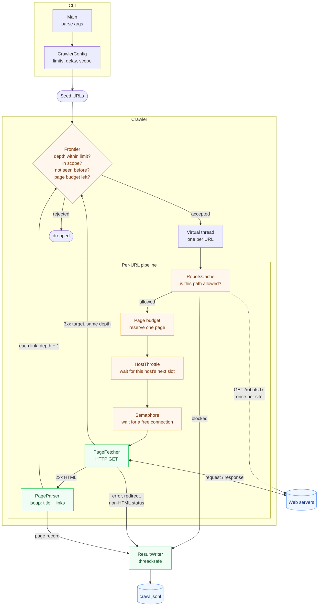
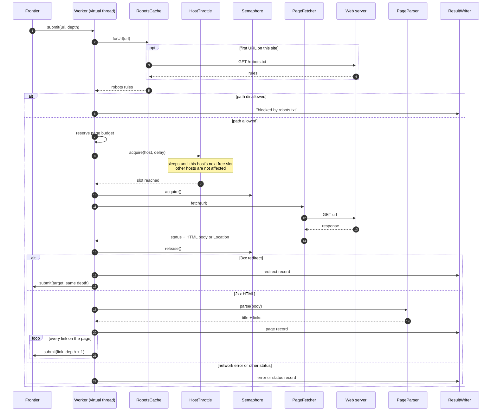
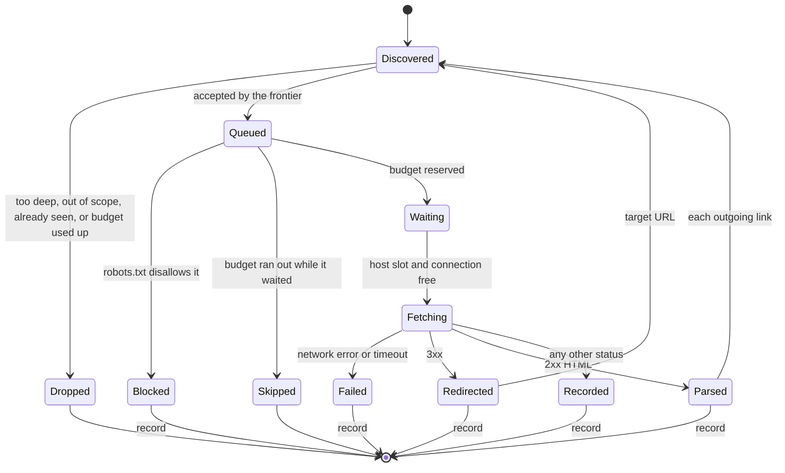
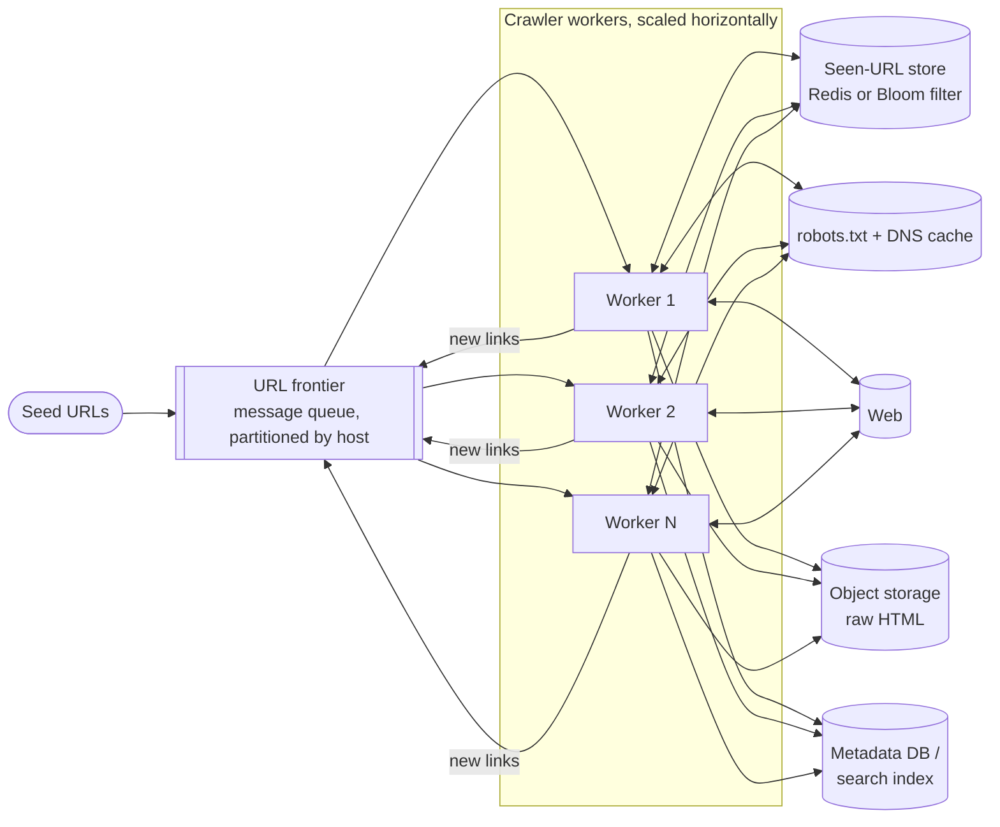

# Web Crawler

A concurrent web crawler written in Java 21. It starts from one or more seed URLs, follows links
breadth-first, and writes one JSON line per page to a `.jsonl` file. It's built to be a polite
crawler: it obeys `robots.txt`, waits between requests to the same host, and stays on the seed's
domain unless you tell it otherwise.

## Build and run

Requires JDK 21+ and Maven.

```bash
mvn package                      # compiles, runs tests, builds target/web-crawler.jar
java -jar target/web-crawler.jar https://example.com --max-pages 50 --max-depth 2
```

Options:

| Option | Default | Meaning |
|---|---|---|
| `--max-pages N` | 100 | Stop after fetching N pages |
| `--max-depth N` | 3 | Follow links at most N hops from a seed (0 = seeds only) |
| `--concurrency N` | 8 | Max simultaneous HTTP requests |
| `--delay-ms N` | 1000 | Minimum gap between requests to the same host |
| `--timeout-s N` | 10 | Connect/response timeout |
| `--output FILE` | `crawl.jsonl` | Where results are written |
| `--user-agent STR` | `JavaWebCrawler/1.0` | Sent as `User-Agent` and matched against `robots.txt` groups |
| `--allow-external` | off | Follow links to other domains too |

## Output

One JSON object per line, flushed as the crawl runs:

```json
{"url":"https://example.com/","depth":0,"status":200,"contentType":"text/html; charset=UTF-8","title":"Example Domain","links":["https://www.iana.org/domains/example"],"fetchMs":142,"fetchedAt":"2026-09-25T11:02:10.512Z"}
{"url":"https://example.com/old","depth":1,"status":301,"redirectTo":"https://example.com/new","fetchMs":38,"fetchedAt":"..."}
{"url":"https://example.com/admin","depth":1,"error":"blocked by robots.txt","fetchedAt":"..."}
{"url":"https://example.com/slow","depth":1,"error":"HttpTimeoutException: request timed out","fetchMs":10004,"fetchedAt":"..."}
```

Query it with `jq`, for example to list broken links: `jq -c 'select(.status >= 400) | .url' crawl.jsonl`.

## Design

### Architecture

Every URL the frontier accepts runs on its own virtual thread and goes through the pipeline below.
Links found on the page, and redirect targets, go back into the frontier, so the crawl keeps
feeding itself until nothing new is accepted.



Orange boxes are gates, where a URL is rejected or waits its turn. Green boxes do the work, and
blue ones are outside the program.

### Life of one URL

What a single worker thread does, in order, and who it talks to:



### URL states

Every URL ends in exactly one final state. Only the states marked with a record appear in
`crawl.jsonl`.



### When the crawl finishes

A `pending` counter tracks URLs that are queued or running. It starts at 1, so it can't reach zero
while the seeds are still being submitted. Each worker submits its links before it finishes, so
the counter only reaches zero once no work is left.


### Components

| Class | Role |
|---|---|
| `Main` | CLI entry point: parses args, runs the crawl, prints a summary |
| `CrawlerConfig` | Settings, argument parsing and validation |
| `Crawler` | The frontier plus the per-URL pipeline; decides when the crawl is finished |
| `UrlNormalizer` | Canonical URLs (lowercase host, no fragment/default port, `..` resolved) so each page is fetched once |
| `RobotsTxt` / `RobotsCache` | RFC 9309 parsing: agent groups, `Allow`/`Disallow` with `*` and `$`, longest match wins, `Crawl-delay` |
| `HostThrottle` | Per-host time slots so one site is never hit faster than the delay, while other hosts proceed in parallel |
| `PageFetcher` | Java `HttpClient` wrapper |
| `PageParser` | jsoup HTML parsing with charset detection |
| `ResultWriter` / `CrawlResult` | Thread-safe JSONL output |

### Design decisions

- **Virtual threads instead of a worker pool.** Each URL is a cheap virtual thread, so blocking
  code (sleeping for politeness, waiting on HTTP) stays simple. A semaphore limits actual network
  concurrency.
- **Redirects go through the frontier.** The HTTP client doesn't follow them automatically. The
  target URL gets the same dedup, scope and `robots.txt` checks as a normal link, and it keeps the
  depth of the page that redirected.
- **Termination by counting.** A counter tracks URLs that are queued or running. Children are
  submitted before their parent finishes, so the count reaches zero only when no work is left.
- **Scope.** Without `--allow-external`, the crawler stays on each seed's domain (with `www.`
  stripped) and its subdomains.
- **Politeness wins over speed.** With a single seed site, requests go out one per `--delay-ms`,
  whatever `--concurrency` is. Concurrency only helps when crawling several hosts.

### Scaling beyond one machine

The crawler runs as one process today. A crawl at the scale of a search engine keeps the same
pipeline, but moves the shared in-memory parts into separate services, so many workers can run in
parallel. This is a possible direction, not something implemented here:



| Here (one process) | Distributed version |
|---|---|
| `seen` set in memory | Shared Redis set, or a Bloom filter to save memory |
| Executor task queue | Durable message queue (for example Kafka), partitioned by host |
| `HostThrottle` | Each host belongs to one partition, so one worker controls its request rate |
| `RobotsCache` | Shared cache with a time-to-live, plus a DNS cache |
| `crawl.jsonl` | Object storage for page bodies, database or search index for metadata |

Partitioning by host is the key choice: every request to a given site goes through one worker, so
the per-site delay still works without coordinating across machines.

## Tests

`mvn test` runs unit tests for URL normalization and robots.txt matching. It also runs an
end-to-end test that crawls a small site served by an in-process HTTP server, covering redirects,
robots blocking, depth and page limits. The tests don't need internet access.

## Ideas for extending it

- Save the raw HTML (`--save-html DIR`) alongside the metadata
- Follow `<link rel="canonical">` and honor `<meta name="robots" content="nofollow">`
- Seed from `sitemap.xml`
- Persist the frontier so a stopped crawl can resume
