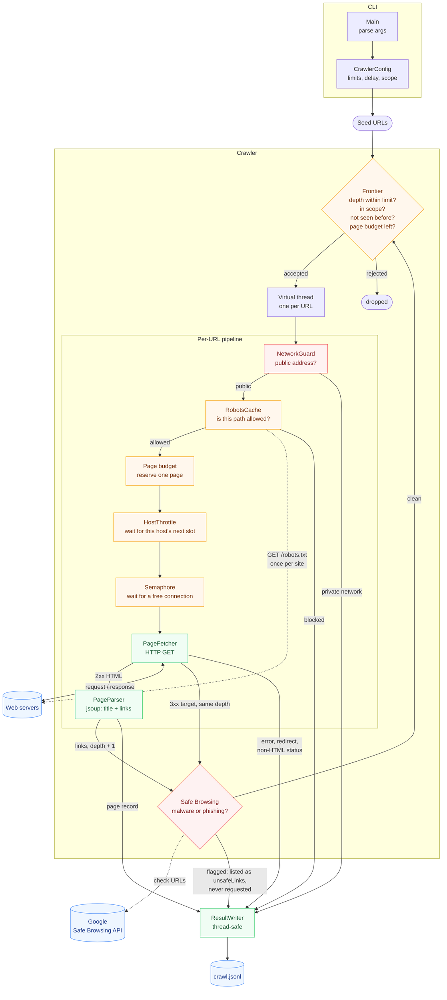
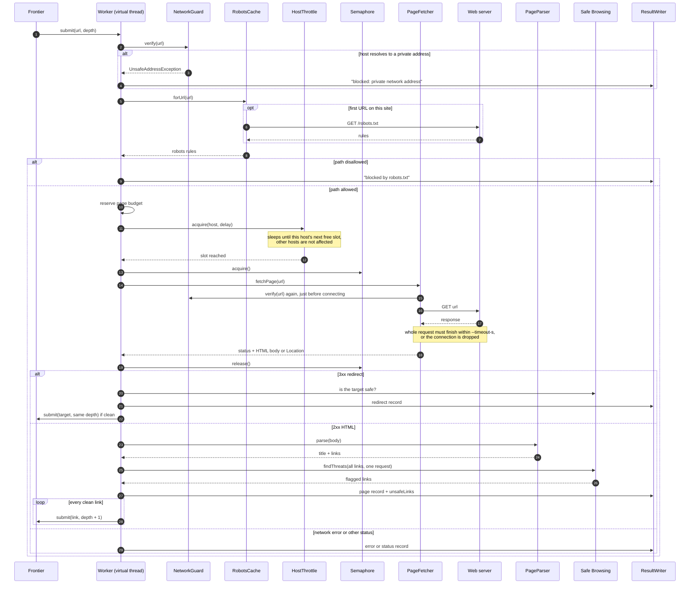
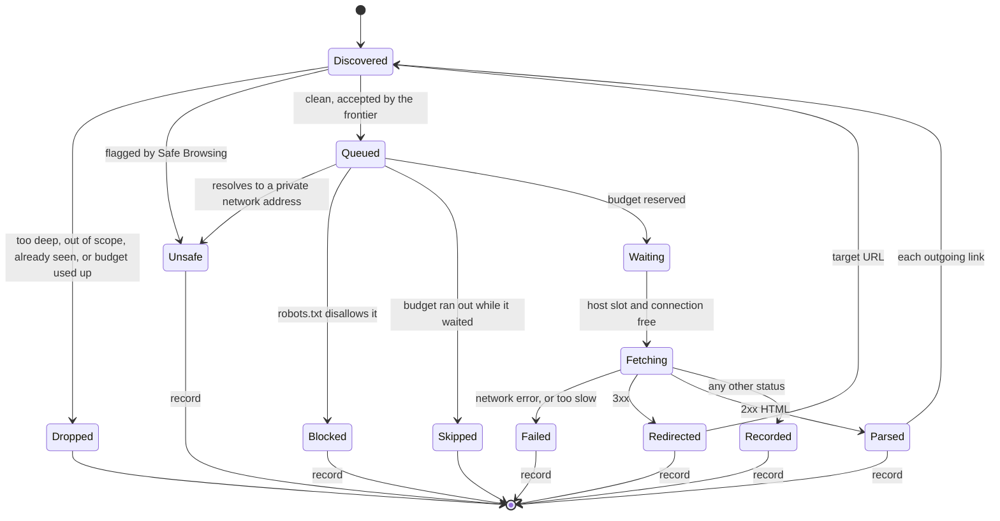
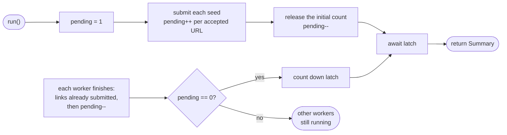

# Web Crawler

A concurrent web crawler written in Java 21. It starts from one or more seed URLs, follows links
breadth-first, and writes one JSON line per page to a `.jsonl` file. It's built to be a polite
crawler: it obeys `robots.txt`, waits between requests to the same host, and stays on the seed's
domain unless you tell it otherwise. It's also built to be safe to run: it never contacts your
private network, gives up on servers that stall, and can check every link for malware with Google
Safe Browsing before visiting it (see [Safety](#safety)).

## Build and run

Requires JDK 21+ and Maven.

```bash
mvn package                      # compiles, runs tests, builds target/web-crawler.jar
java -jar target/web-crawler.jar https://example.com --max-pages 50 --max-depth 2
```

Options:

| Option | Default | Meaning |
|---|---|---|
| `--max-pages N` | 100 | Stop after fetching N pages |
| `--max-depth N` | 3 | Follow links at most N hops from a seed (0 = seeds only) |
| `--concurrency N` | 8 | Max simultaneous HTTP requests |
| `--delay-ms N` | 1000 | Minimum gap between requests to the same host |
| `--timeout-s N` | 10 | Max seconds for one request, including the download |
| `--output FILE` | `crawl.jsonl` | Where results are written |
| `--user-agent STR` | `JavaWebCrawler/1.0` | Sent as `User-Agent` and matched against `robots.txt` groups |
| `--allow-external` | off | Follow links to other domains too |
| `--allow-private-network` | off | Allow `localhost` and private network addresses. Use only to crawl your own local server |

| Environment variable | Meaning |
|---|---|
| `SAFE_BROWSING_API_KEY` | Google Safe Browsing API key. When set, every link is checked for malware and phishing before it's crawled |

## Output

One JSON object per line, flushed as the crawl runs:

```json
{"url":"https://example.com/","depth":0,"status":200,"contentType":"text/html; charset=UTF-8","title":"Example Domain","links":["https://www.iana.org/domains/example"],"fetchMs":142,"fetchedAt":"2026-09-25T11:02:10.512Z"}
{"url":"https://example.com/old","depth":1,"status":301,"redirectTo":"https://example.com/new","fetchMs":38,"fetchedAt":"..."}
{"url":"https://example.com/admin","depth":1,"error":"blocked by robots.txt","fetchedAt":"..."}
{"url":"https://example.com/slow","depth":1,"error":"HttpTimeoutException: gave up after 10s: server too slow","fetchMs":10004,"fetchedAt":"..."}
{"url":"https://example.com/files","depth":1,"status":200,"title":"Downloads","links":["..."],"unsafeLinks":{"https://bad.example/setup.exe":"MALWARE"},"fetchMs":95,"fetchedAt":"..."}
{"url":"http://localhost:8080/","depth":0,"error":"blocked: localhost is a private network address (127.0.0.1)","fetchedAt":"..."}
```

Query it with `jq`, for example to list broken links: `jq -c 'select(.status >= 400) | .url' crawl.jsonl`,
or every malicious link that was found: `jq -c 'select(.unsafeLinks) | {url, unsafeLinks}' crawl.jsonl`.

## Safety

A crawler visits pages written by strangers, so it has to assume some of them are hostile.

**What can't happen, by design:**

- **Nothing downloaded is ever run.** There's no browser engine and no JavaScript. jsoup only reads
  HTML as text, so browser exploits and drive-by downloads have nothing to attack.
- **Only HTML is downloaded.** For executables, archives, PDFs and every other type, the crawler
  records the status code and never reads the file. Even HTML stays in memory; only metadata
  (URL, title, links, status) is written to disk.
- **Downloads are size-capped.** A page body stops at 5 MB and `robots.txt` at 500 KB. The crawler
  doesn't ask for compressed responses, so a "zip bomb" (a tiny file that decompresses to a huge
  one) can't reach it.

**What the crawler actively checks:**

| Threat | Protection |
|---|---|
| **Malware and phishing links** | With `SAFE_BROWSING_API_KEY` set, every link and redirect target is checked with [Google Safe Browsing](https://developers.google.com/safe-browsing/v4/lookup-api) before it's crawled. Flagged links are never requested and are listed under `unsafeLinks` on the page that contains them. If the check itself fails, the links aren't followed. Skipping links is safer than guessing. |
| **Requests into your own network** | A page can link or redirect to `localhost`, your router, or the cloud metadata service at `169.254.169.254`. Before every request, including redirects and `robots.txt`, the crawler looks up the host's addresses and refuses loopback, private LAN, link-local, carrier-grade NAT and reserved ranges, for IPv4 and IPv6. |
| **Servers that stall** | `--timeout-s` covers the whole request, download included. A server that sends one byte at a time is dropped when the time runs out, and its connection is closed. |
| **Crawler traps** | Sites with endless generated URLs (calendars, ever-deeper paths) are cut off by `--max-pages` and `--max-depth`. |

**Getting a Safe Browsing key (free):** in the [Google Cloud console](https://console.cloud.google.com/),
create a project, enable the **Safe Browsing API**, and create an API key under *APIs & Services →
Credentials*. Then:

```bash
export SAFE_BROWSING_API_KEY="your-key"
java -jar target/web-crawler.jar https://example.com
```

The key is read from the environment rather than a command-line flag, so it doesn't end up in your
shell history or in the process list. Google's free Lookup API is for non-commercial use. For
commercial use, Google offers the Web Risk API instead.

**Treat the output as untrusted.** Titles and URLs in `crawl.jsonl` come straight from the pages.
If you ever display them on a web page, escape them first, or a malicious title could inject
script into your page.

## Design

### Architecture

Every URL the frontier accepts runs on its own virtual thread and goes through the pipeline below.
Links found on the page, and redirect targets, go back into the frontier, so the crawl keeps
feeding itself until nothing new is accepted.



Red boxes are safety checks and orange boxes are the other gates, where a URL is rejected or waits
its turn. Green boxes do the work, and blue ones are outside the program.

### Life of one URL

What a single worker thread does, in order, and who it talks to:



### URL states

Every URL ends in exactly one final state. Only the states marked with a record appear in
`crawl.jsonl`.



### When the crawl finishes

A `pending` counter tracks URLs that are queued or running. It starts at 1, so it can't reach zero
while the seeds are still being submitted. Each worker submits its links before it finishes, so
the counter only reaches zero once no work is left.



### Components

| Class | Role |
|---|---|
| `Main` | CLI entry point: parses args, runs the crawl, prints a summary |
| `CrawlerConfig` | Settings, argument parsing and validation |
| `Crawler` | The frontier plus the per-URL pipeline; decides when the crawl is finished |
| `UrlNormalizer` | Canonical URLs (lowercase host, no fragment/default port, `..` resolved) so each page is fetched once |
| `RobotsTxt` / `RobotsCache` | RFC 9309 parsing: agent groups, `Allow`/`Disallow` with `*` and `$`, longest match wins, `Crawl-delay` |
| `HostThrottle` | Per-host time slots so one site is never hit faster than the delay, while other hosts proceed in parallel |
| `PageFetcher` | Java `HttpClient` wrapper: one deadline for the whole request, size-capped bodies |
| `NetworkGuard` | Refuses hosts that resolve to loopback, private, link-local or reserved addresses |
| `SafeBrowsing` | Checks URLs against Google Safe Browsing, up to 500 per request |
| `PageParser` | jsoup HTML parsing with charset detection |
| `ResultWriter` / `CrawlResult` | Thread-safe JSONL output |

### Design decisions

- **Virtual threads instead of a worker pool.** Each URL is a cheap virtual thread, so blocking
  code (sleeping for politeness, waiting on HTTP) stays simple. A semaphore limits actual network
  concurrency.
- **Redirects go through the frontier.** The HTTP client doesn't follow them automatically. The
  target URL gets the same dedup, scope, safety and `robots.txt` checks as a normal link, and it
  keeps the depth of the page that redirected.
- **Safety checks fail closed.** If Safe Browsing can't be reached, links aren't followed. If
  `robots.txt` redirects into a private network, the whole site is skipped.
- **Termination by counting.** A counter tracks URLs that are queued or running. Children are
  submitted before their parent finishes, so the count reaches zero only when no work is left.
- **Scope.** Without `--allow-external`, the crawler stays on each seed's domain (with `www.`
  stripped) and its subdomains.
- **Politeness wins over speed.** With a single seed site, requests go out one per `--delay-ms`,
  whatever `--concurrency` is. Concurrency only helps when crawling several hosts.

### Scaling beyond one machine

The crawler runs as one process today. A crawl at the scale of a search engine keeps the same
pipeline, but moves the shared in-memory parts into separate services, so many workers can run in
parallel. This is a possible direction, not something implemented here:


| Here (one process) | Distributed version |
|---|---|
| `seen` set in memory | Shared Redis set, or a Bloom filter to save memory |
| Executor task queue | Durable message queue (for example Kafka), partitioned by host |
| `HostThrottle` | Each host belongs to one partition, so one worker controls its request rate |
| `RobotsCache` | Shared cache with a time-to-live, plus a DNS cache |
| `crawl.jsonl` | Object storage for page bodies, database or search index for metadata |

Partitioning by host is the key choice: every request to a given site goes through one worker, so
the per-site delay still works without coordinating across machines.

## Tests

`mvn test` runs unit tests for URL normalization, robots.txt matching, and the private-address
checks (IPv4, IPv6 and IPv6 forms that carry an IPv4 address). It also runs end-to-end tests that
crawl a small site served by an in-process HTTP server. They cover redirects, robots blocking,
depth and page limits, and the safety features: private addresses are refused, a fake Safe
Browsing API flags a link that must never be requested, and a server that stalls mid-download is
dropped after the timeout. The tests don't need internet access.

## Ideas for extending it

- Save the raw HTML (`--save-html DIR`) alongside the metadata
- Follow `<link rel="canonical">` and honor `<meta name="robots" content="nofollow">`
- Seed from `sitemap.xml`
- Persist the frontier so a stopped crawl can resume
